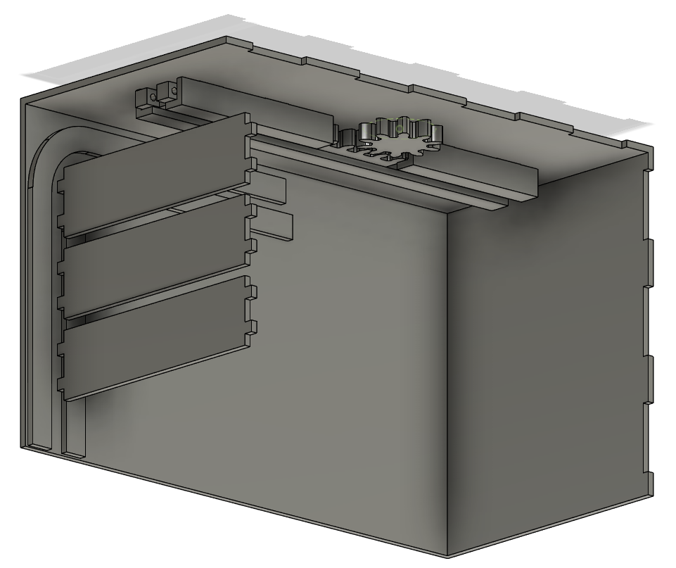

# Garage - Digital Twin

GitHub page for the "Programming of robots and other physical devices" project on the Software Engineering Master (elective) @ SDU F24

## Project

The project concerns itself with IoT and Digital Twins.

In it we have to design a physical and virtual representation of any given thing of our choice. We chose to design a garage. The specific requirements to the physical and virtual representation are as follows:

- Physical: ESP32 D1 Mini + Sensors/Actuators + 3D printing
- Virtual: Unity
- Communication: Wireless (UDP)

## Repository

This repository contains all parts of the project:

- `src/`: C++ code for interacting with the ESP32 and the sensors, actuators, keypad and motors.
- `Unity/GarageTwin/`: All code related to the virtual representation of the digital twin, created in Unity
- `models/`: All 3D printed models, laser cut designs as well as a part lists to recreate the whole project.

## Authors

- [Jonas Solhaug Kaad](https://github.com/JonasKaad)
- [Victor Andreas Boye](https://github.com/VictorABoye)
- [Sebastian Christensen Mondrup](https://github.com/SebMon)
- [Alexander Vinding Nørup](https://github.com/AlexanderNorup)

**Supervisor**: Bjarke Kristian Maigaard Kjær Pedersen: bkp@mmmi.sdu.dk
