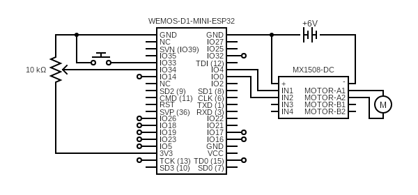

# Recreation

To recreate this project, you will need to 3D print the required parts, laser cut the garage and obtain

- `3DPrints/`: Contains all the `.STL` files that you need to 3D print.
- `LasercutDesigns/`: Contains all `.SVG` files that need to be lasercut. The design can be seen below
- Also below are all the

## Electronic Parts

- [ESP 32](https://arduinotech.dk/shop/live-d1-mini-esp32-development-board-based-esp8266/)
- [Breadboard](https://arduinotech.dk/shop/breadboard-830-points/)
- [DC Motor](https://arduinotech.dk/shop/n20-micro-metal-gear-motor/)
- [Motor Driver](https://arduinotech.dk/shop/mx1508-dc-motor-driver-module/)
- [LCD Screen](https://arduinotech.dk/shop/lcd-1602-16x2-w-pinheader/)
  - [LCD I2C Serial Interface](https://arduinotech.dk/shop/lcd-serial-interface/)
- [Battery Holder 4x AA](https://arduinotech.dk/shop/battery-holder-4-x-aa/)
- [4x AA Batteries](https://www.harald-nyborg.dk/kameda-alkaline-batteri-aa-10-pak)
- [Relay Module](https://arduinotech.dk/shop/3v-relay-module-high-and-low-level-trigger-dual-optocoupler-isolation/)
- 12x [Buttons](https://arduinotech.dk/shop/switch-tactile-push-button-6x6x7mm/)
- [Potentiometer](https://arduinotech.dk/shop/potentiometer/)
- Cables
  - [Male-to-Male](https://arduinotech.dk/shop/65-stk-jump-wire-for-breadboard-and-arduino/)
  - [Male-to-Female](https://arduinotech.dk/shop/dupont-wire-30cm/)

## Laser cutting designs

- Doors:
  
- Back
  
- Roof:
  
- Left side:
  
- Right side:
  
